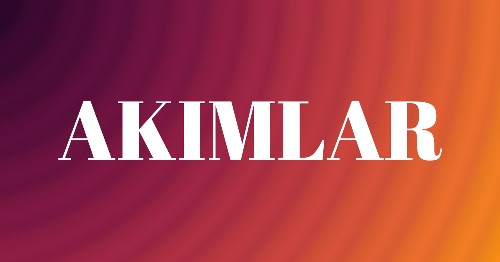

<h1 align="center">Welcome to edb-akimlar 👋</h1>

  
  
  

> Edebiyat akımlarını tanıtan bir Websitesi, edebiyat dersi projem | A Website spotlighting literary movements, also my literature class project

### 🏠 [Ziyaret Et | Visit](https://edebi-akimlar.vercel.app)

## Author

👤 **Tolga Erdönmez**

- Twitter: [@tolgaerdonmez](https://twitter.com/tolgaerdonmez)
- Github: [@tolgaerdonmez](https://github.com/tolgaerdonmez)
- LinkedIn: [@tolgaerdonmez](https://linkedin.com/in/tolgaerdonmez)
